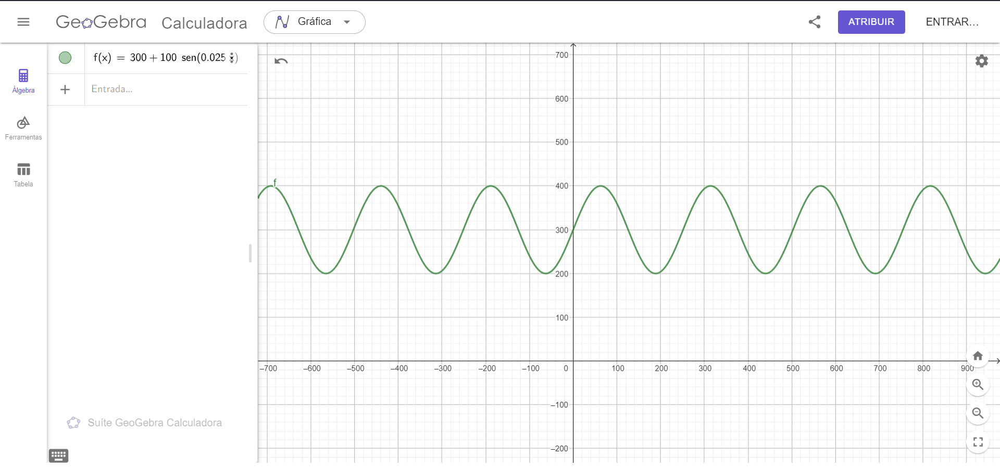

Live game: https://caio-alcantara.github.io/exercicio_passaro/

Gráfico da função pensada para o movimento vertical do pássaro:

A função foi pensada especificamente para que o pássaro se mantesse entre a altura 200 e 400
